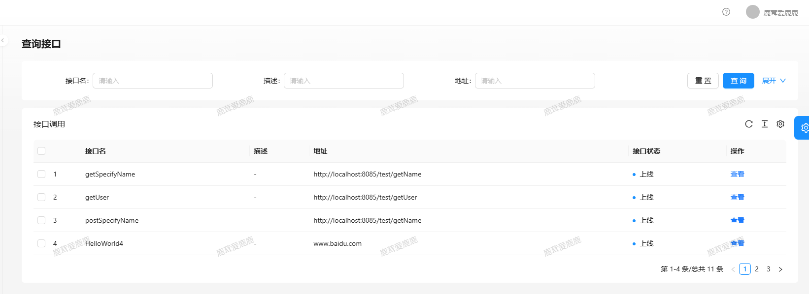
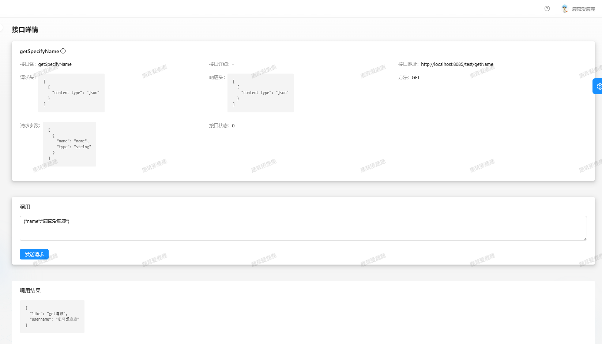

# 项目简单介绍

基于`SpringBoot`+`Dubbo`+`Spring Cloud Gateway`实现的API开放平台，实现接口在线调用






# 项目文件夹及运行

## 项目文件夹

1. **weiapi-backend**：API开放平台后端
2. **weiapi-client-sdk**：接口调用的客户端
3. **weiapi-common**：dubbo的调用接口包
4. **weiapi-gateway**：API开放平台的网关
5. **weiapi-interface**：接口（模拟）

## 运行

1. 运行nacos
   1. cd nacos/bin
   2. startup.cmd -m standalone（启动服务）
2. weiapi-common项目打包
   1. 命令：maven install

3. weiapi-client-sdk项目打包
   1. 命令：maven install

4. 运行spring cloud gateway
5. 运行backend
6. 运行模拟接口项目


> [Nacos官网](https://nacos.io/zh-cn/docs/quick-start.html)
>
> 下载nacos包（[下载地址](https://nacos.io/zh-cn/docs/quick-start.html)）


# 数据库表设计

## 用户表

|    字段名    |             字段描述             |     类型      |
| :----------: | :------------------------------: | :-----------: |
|      id      |               主键               |      int      |
|   username   |               昵称               | varchar(255)  |
| description  |             用户描述             | varchar(255)  |
|  avatarUrl   |               头像               | varchar(1024) |
| userAccount  |               账号               | varchar(255)  |
| userPassword |               密码               | varchar(255)  |
|  userStatus  |             用户状态             |      int      |
|   userRole   | 用户角色（0-普通用户，1-管理员） |    tinyint    |
|  createTime  |             创建时间             |   datetime    |
|  updateTime  |             更新时间             |   datetime    |
|   isDelete   |       是否删除（逻辑删除）       |    tinyint    |

## identify表

> 存储用户的`accessKey`和`secretKey`

| 字段名 | 字段描述 | 类型 |
| :----: | :------: | :--: |
|      id      |               主键，外键，用户编号               |   int    |
| accessKey |          | varchar(50) |
| secretKey |          | varchar(50) |
|  createTime  |             创建时间             | datetime |
|  updateTime  |             更新时间             | datetime |
|   isDelete   |       是否删除（逻辑删除）       | tinyint  |

==为什么不直接将accessKey和secretKey放入用户表==

- 增加维护`user`表的负担
- 往`user`表添加这两个字段后，业务逻辑需要进行修改，又要重新进行测试

## 接口信息表

|     字段名      | 字段描述 | 类型 |
| :-------------: | :------: | :--: |
|       id        | 主键 | bigint |
|  interfaceName  | 接口名 | varchar(255) |
| description | 描述 | varchar(255) |
|       url       | 接口url | varchar(512) |
|  requestHeader  | 请求头信息 | text |
| responseHeader  | 响应头信息 | text |
|     method      | 方法 | varchar(15) |
|     params      | 参数 | text |
| interfaceStatus | 接口状态 | tinyint |
|  createTime  |             创建时间             | datetime |
|  updateTime  |             更新时间             | datetime |
|   isDelete   |       是否删除（逻辑删除）       | tinyint  |

- `url（接口url）`: 存储网关的地址

- `params`

  ```json
  [
      {"name": "username", "type":"string"},
      {"name":"like", "type":"string"}
  ]
  ```

  > 表示需要两个参数*username*和*like*，这两个参数的类型都是*string*

- requestHeader

  ```json
  [
      {"content-type": "json"}
  ]
  ```

  > json数据格式

- responseHeader

  ```json
  [
      {"content-type": "json"}
  ]
  ```

  > json数据格式

- `method`
  - get
  - post


## 用户_接口信息表

> 记录用户调用接口的总次数和剩余次数

|     字段名      | 字段描述 | 类型 |
| :-------------: | :------: | :--: |
|       id        | 主键 | bigint |
| userId | 用户编号，外键 | bigint |
| interfaceId | 接口编号，外键 | bigint |
| totalNum | 总调用次数 | int |
| leftNum | 剩余调用次数 | int |
|  createTime  |             创建时间             | datetime |
|  updateTime  |             更新时间             | datetime |
|   isDelete   |       是否删除（逻辑删除）       | tinyint  |


# 项目实现细节

## sdk客户端

> 项目文件夹：**weiapi-client-sdk**

### 为什么要设计客户端

1. 方便*开发者*直接使用客户端sdk去直接调用接口
2. 客户端对流量进行了*染色*（添加了请求头信息）
   - 使用密钥加密算法生成`sign`（secretKey和参数列表合在一起，使用md5算法生成sign）
   - `random`：随机数（生成的随机数在一定的范围）
   - `timestamp`：时间戳（不能超过一定的时间间隔）
   - `accsessKey`

3. 开发者引入客户端sdk后，通过**application.yml**填写`accessKey`和`secretKey`，自动创建客户端


### 配置类

```java
@Configuration
@ConfigurationProperties(prefix = "wei.client")
@ComponentScan
public class WeiApiClientConfig {
    private String accessKey;
    private String secretKey;

    public String getAccessKey() {
       return accessKey;
    }

    public void setAccessKey(String accessKey) {
       this.accessKey = accessKey;
    }

    public String getSecretKey() {
       return secretKey;
    }

    public void setSecretKey(String secretKey) {
       this.secretKey = secretKey;
    }

    @Bean
    public WeiApiClient weiApiClient() {
       return new WeiApiClient(accessKey, secretKey);
    }
}
```

==注意点==

`accessKey`和`secretKey`一定要有对应的`set`和`get`方法，否则无法将**application.yml**文件里的`accessKey`和`secretKey`配置到配置类中


### spring.factories

在==resources==文件夹中创建==/META-INF/spring.factories==

> 当引入该sdk时，WeiApiClientConfig自动配置

```tex
org.springframework.boot.autoconfigure.EnableAutoConfiguration=com.li.weiapiclientsdk.config.WeiApiClientConfig
```

> 该项目还需要导入一个包

```xml
<!--  为sdk自动生成代码提示 -->
<dependency>
    <groupId>org.springframework.boot</groupId>
    <artifactId>spring-boot-configuration-processor</artifactId>
    <optional>true</optional>
</dependency>
```


### 细节

1. 删除SpringBoot启动类

2. pom.xml删除以下语句

   ```xml
   <build>
       <plugins>
           <plugin>
               <groupId>org.apache.maven.plugins</groupId>
               <artifactId>maven-compiler-plugin</artifactId>
               <configuration>
                   <source>7</source>
                   <target>7</target>
               </configuration>
           </plugin>
       </plugins>
   </build>
   ```

3. maven打包

   命令：*maven install*，会将打包好的jar包，放到本地仓库

   项目**weiapi-backend**会使用到

   ```xml
   <dependency>
       <groupId>com.li</groupId>
       <artifactId>weiapi-client-sdk</artifactId>
       <version>0.0.1</version>
       <exclusions>
           <exclusion>
               <groupId>org.springframework.boot</groupId>
               <artifactId>spring-boot</artifactId>
           </exclusion>
       </exclusions>
   </dependency>
   ```


### 测试客户端

*application.yml*

```yaml
wei:
  client:
    access-key: 1afd69cc2ec5159f6ccd285f139bc772
    secret-key: e8aa390d1714c1c26ce212591361e0a3
```

*测试代码*

```java
@SpringBootTest
class WeiapiTestSdkApplicationTests {
    @Autowired
    private WeiApiClient weiApiClient;

    @Test
    void contextLoads() {
       UserInvokeInterfaceRequest request = new UserInvokeInterfaceRequest();
       request.setUrl("http://localhost:8085/test/getUser");
       request.setMethod("POST");
       request.setUserParams("{\"username\":\"quake\",\"like\":\"pingpong\"}");

       Map<String, Object> stringObjectMap = weiApiClient.generalInvokeInterface(request);
       System.out.println(stringObjectMap);
    }
}
```


## gateway网关

1. 接口调用统一鉴权（校验请求头信息）
2. 验证接口是否存在（**dubbo**）
3. 用户能否调用接口（**dubbo**）
4. 接口调用日志记录
5. 统计用户调用接口的次数（**dubbo**）


## Dubbo

### 为什么要使用Dubbo

*dubbo*是分布式*RPC*框架，实现项目中不同模块的高性能相互调用

*Gateway网关*中使用到*weiapi-backend*的部分接口

1. 接口信息返回`getInterfaceInfoByPathAndMethod`
2. 用户能否调用接口`canInvoke`
3. 更新用户调用接口次数`updateCount`
4. 通过用户编号获取密钥`getIdentityByUserId`


### weiapi-common

> 需要相互调用的接口

```java
public interface InnerIdentityService {
	/**
	 * 通过用户编号得到密钥
	 * @param accessKey 密钥
	 * @return
	 */
	InnerIdentify getIdentityByUserId(String accessKey);
}

public interface InnerInterfaceInfoService {
	/**
	 * 通过路径和方法查询接口信息
	 * @param url
	 * @param method
	 * @return
	 */
	InnerInterfaceInfo getInterfaceInfoByPathAndMethod(String url, String method);
}

public interface InnerUserInterfaceService {
	/**
	 * 根据用户编号和接口编号更新次数
	 * @param userId
	 * @param interfaceId
	 * @return
	 */
	boolean updateCount(Long userId, Long interfaceId);

	/**
	 * 验证用户可以调用接口
	 * @param userId
	 * @param interfaceId
	 * @return
	 */
	boolean canInvoke(Long userId, Long interfaceId);
}
```

==poml文件细节==

```xml
<build>
    <plugins>
        <!-- 编译级别 -->
        <plugin>
            <groupId>org.apache.maven.plugins</groupId>
            <artifactId>maven-compiler-plugin</artifactId>
            <version>3.1</version>
            <configuration>
                <source>${jdk.version}</source>
                <target>${jdk.version}</target>
            </configuration>
        </plugin>
        <!-- Source attach plugin -->
        <plugin>
            <groupId>org.apache.maven.plugins</groupId>
            <artifactId>maven-source-plugin</artifactId>
            <executions>
                <execution>
                    <id>attach-sources</id>
                    <goals>
                        <goal>jar</goal>
                    </goals>
                </execution>
            </executions>
        </plugin>
    </plugins>
</build>
```


### 使用Dubbo

服务提供者项目和服务消费者项目都需要导入以下包

```xml
<!--  dubbo -->
<dependency>
    <groupId>org.apache.dubbo</groupId>
    <artifactId>dubbo-spring-boot-starter</artifactId>
    <version>3.3.0-beta.1</version>
</dependency>
<dependency>
    <groupId>com.alibaba.nacos</groupId>
    <artifactId>nacos-client</artifactId>
    <version>2.1.0</version>
</dependency>
<!--  前面项目的jar包 -->
<dependency>
    <groupId>com.li</groupId>
    <artifactId>weiapi-common</artifactId>
    <version>0.0.1</version>
</dependency>
```

==服务提供==

```java
@DubboService
public class InnerIdentityServiceImpl implements InnerIdentityService{
    @Resource
    private IdentifyMapper identifyMapper;

    @Override
    public InnerIdentify getIdentityByUserId(String accessKey) {
       QueryWrapper<Identify> wrapper = new QueryWrapper<>();
       wrapper.eq("accessKey", accessKey);

       Identify identify = identifyMapper.selectOne(wrapper);
       InnerIdentify innerIdentify = new InnerIdentify();
       if (identify != null) {
          BeanUtils.copyProperties(identify, innerIdentify);
       }

       return innerIdentify;
    }
}
```

> 实现`weiapi-common`包里的接口文件

主类中打上**@EnableDubbo**注解

application.yml（配置）

```yaml
dubbo:
  application:
    name: weiapi-backend
  protocol:
    name: tri
    port: 50052
  registry:
  	# nacos服务器地址
    address: nacos://localhost:8848
```


==服务调用==

```java
@DubboReference
private InnerIdentityService identityService;

@DubboReference
private InnerInterfaceInfoService interfaceInfoService;

@DubboReference
private InnerUserInterfaceService userInterfaceService;
```

> 可通过`InnerIdentify innerIdentify = identityService.getIdentityByUserId(accessKey);`调用相应的方法

主类中打上**@EnableDubbo**注解

application.yml（配置）

```yaml
dubbo:
  application:
    name: weiapi-gateway
    qos-port: 33333
  registry:
    address: nacos://localhost:8848
```


# 总结

1. 使用**Hutools**工具，请求http，方便用户调用第三方接口，也方便开发者编写sdk

   可发送get, post请求，对请求返回值进行了封装（返回一个json字符串，需要自行解析）

   可使用JSON工具包解析json字符串

2. 使用**Dubbo**访问其他项目的接口，降低耦合度，使得项目代码更加容易维护

   Dubbo就是分为注册中心、服务提供者、服务消费者，这里将服务写成一个接口，需要服务提供者实现该服务，并将服务上传到注册中心，服务消费者从注册中心里调用服务

   使得网关能直接调用（无感，就像调用自己项目的接口）backend项目的接口，而不需要通过Hutools工具或打包形式调用接口

   使用了nacos（注册中心）而没有使用zookeeper（注册中心）

3. 使用**SpingCloud gateway**，给第三方接口提供网关服务（提高第三方接口的安全性），提供调用统计、流量染色功能，防止用户直接调用第三方接口

   发送到网关的请求统一转发到第三方接口。定义全局拦截器，统一进行接口调用鉴权，防止攻击者恶意调用，统一进行日志输出，统一进行接口调用次数统计
